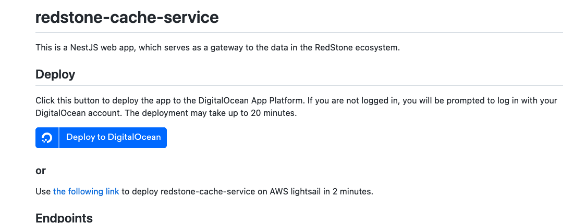
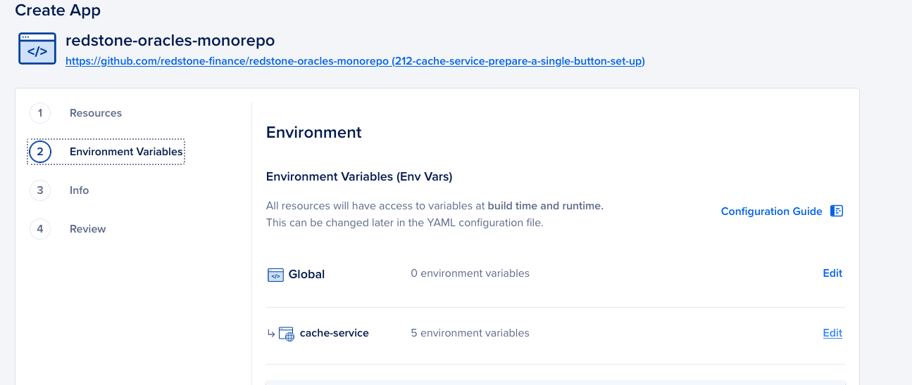
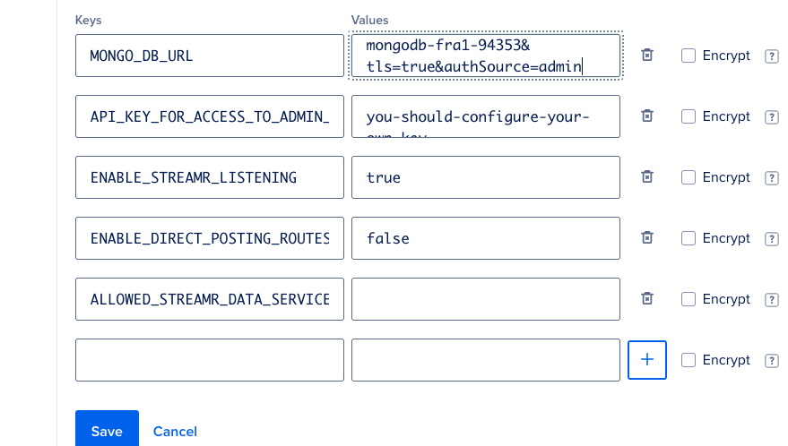
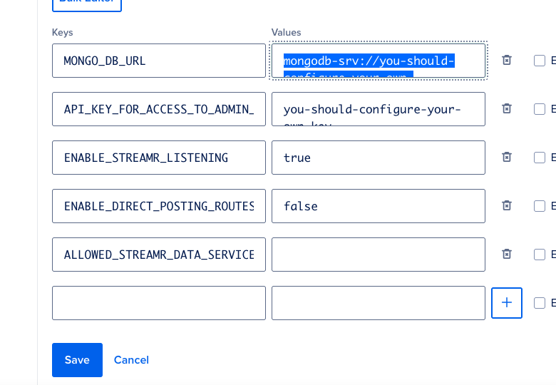
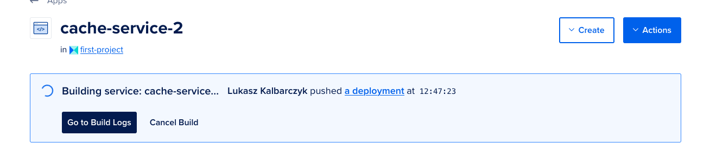

## Set Up the cache-service node.

Once you have the MongoDB [database cluster created](https://github.com/redstone-finance/redstone-oracles-monorepo/tree/main/.do/app/), you can use the button to simply create the cache-service node.

You will be moved to the DigitalOcean Platform.

Select the Environment Variables tab on the left pane.

Then into the MONGO_DB-field's value put the database connection string you've copied from your MongoDB cluster.

You can now save the values, select the Review tab and start creating your app.

