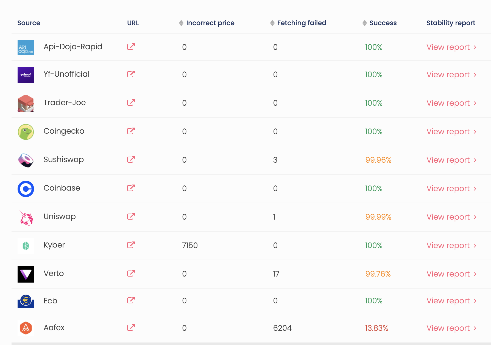

# How to prepare a new manifest

Manifest is a public JSON file that defines the provider's obligation regarding the data that they provide. It sets fetching interval, tokens, sources and other public technical details for the provided data.

## Examples

These are examples of ready-to-use manifests:

- [main.json](../manifests/main.json) - 1000+ tokens, used by the main redstone provider
- [rapid.json](../manifests/rapid.json) - 10 most popular tokens, used by `redstone-rapid` provider
- [coingecko.json](../manifests/coingecko.json) - 203 tokens, uses only coingecko fetcher

## Manifest structure

| Param           | Optionality | Type     | Description                                                                                                                                                                                                                                                                                        |
| --------------- | ----------- | -------- | -------------------------------------------------------------------------------------------------------------------------------------------------------------------------------------------------------------------------------------------------------------------------------------------------- |
| interval        | required    | Number   | Data fetching interval in milliseconds                                                                                                                                                                                                                                                             |
| priceAggregator | required    | String   | Aggregator id. Currently only `median` aggregator is supported                                                                                                                                                                                                                                     |
| defaultSource   | optional    | String[] | Array of fetcher names that will be used by default for tokens that have no specified sources                                                                                                                                                                                                      |
| sourceTimeout   | required    | Number   | Default timeout in milliseconds for sources                                                                                                                                                                                                                                                        |
| deviationCheck  | required    | Object   | Default maximum price deviation percent for tokens. It may also be set for each token separately                                                                                                                                                                                                   |
| tokens          | required    | Object   | Object with tokens in the following format: `{ "TOKEN_SYMBOL": { "source": ["source-name-1", "source-name-2", ...] }, ... }`. Note that `source` and `deviationCheck` params per token are optional. This is also a correct tokens configuration: `{ "TOKEN_SYMBOL_1": {}, "TOKEN_SYMBOL_2": {} }` |

## Manifest file

You should place your JSON manifest file inside the `manifests` folder. The manifest file should be named using kebab case, i.e: `manifest.json`, `good-manifest.json`, or `your-source.json`.

You can also publish your manifest to the Arweave smart contracts using this [manifest deployment guide.](./DEPLOY_MANIFEST_ON_ARWEAVE.md)

## Available sources

You can find a list of available sources along with its stability details in the RedStone Web app: [app.redstone.finance/#/app/sources.](https://app.redstone.finance/#/app/sources)

