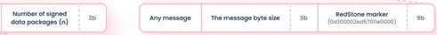

### ToN RedStone payload serialization

Due to limitations of the Bag-size in ToN (see https://docs.ton.org/develop/data-formats/cell-boc), 
the RedStone payload data - represented as a hex string - needed to be passed to a contract in a more complex way.

Having the RedStone payload as defined here https://docs.redstone.finance/img/payload.png,
the data should be passed as a Cell built as follows.

1. The main *payload* cell consists of:
   1. the metadata in the **data-level bits** consisting of the parts as on the image:\
      
   1. `1 ... 4` **refs** to *data-package-container* cells.
1. Each *data-package-container* cell consists of `1 ... 4` *data-package* cells.
1. Each *data-package* cell consists of:
   1. the data package's signature in the **data-level bits**:\
      
   1. one **ref** to a cell containing the data of the rest of the data package on its **data-level**:\
      

#### Current implementation limitations

* The RedStone payload must be fetched by explicitly defining data feeds, 
  which leads to **one data point** belonging to **one data package**.
* The total number of data packages must be in range `1 ... 4 * 4 = 16` 
  (for example `4` feeds times `4` unique signers or `3` feeds times `5` unique signers).
* The unsigned metadata size must not be exceeding `127 - (2 + 3 + 9) = 113` bytes.

#### Helper

The ```createPayloadCell``` method in the [create-cell.ts](src/create-cell.ts) file 
checks the limitations and prepares the data to be sent to the contract as described above.

#### Sample serialization 

The image below contains data for `2` feeds times `3` unique signers:\
